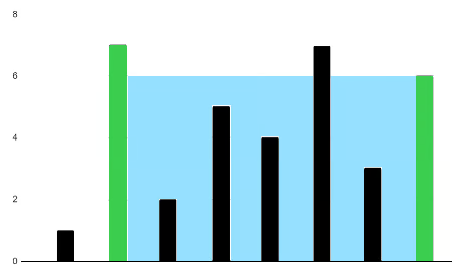

# Container With Most Water - Two Pointers

You are given an integer array `heights` where `heights[i]` represents the height of the $i^{th}$ bar.

You may choose any two bars to form a container. Return the *maximum* amount of water a container can store.


Example 1: 


Input: height = [1,7,2,5,4,7,3,6]

Output: 36

Explanation: The bars at indices 1 and 7 have heights 7 and 6. The container has width 7 - 1 = 6 and height min(7, 6) = 6, so it can store 6 * 6 = 36 units of water. This is the maximum possible area.

## Intuition

[Explain your initial approach and thought process]

## Approach

[Detailed steps of your solution strategy]

1. a
    - b
2. c
    - d
        - e

## Complexity

- Time complexity: O(n)
- Space complexity: O(1)

## Code

<details>

<summary>Java attempt 1</summary>

```java
class Solution {
    public int maxArea(int[] heights) {
        //is it worth keeping track of the distance between the indices? - yes, this is your width

        //with example height = [1,7,2,5,4,7,3,6], why don't we stop and return the answer at index 1, and index 5? We have to keep track of this with a variable - yes, there is a better index with a longer width

        //if we use two pointers, with one at index 0, one at index heights.length - 1, what condition would make them equal each other? - a ponter a l and a pointer at r, with each pointer converging to one-another on a certain condition

        int l = 0;
        int r = heights.length - 1;
        int runningMax = 0;

        while (l < r){
            int width = r - l;
            int area = width * Math.min(heights[l], heights[r]);
            runningMax = Math.max(runningMax, area);
            if (heights[l] < heights[r]) { //if the current value of heights[l] is less than heights[r]- shorter height - increment l
                l++;
            } else {
                r--;
            }
        }
        return runningMax;
    }
}
```
</details>


## Notes

[Any additional notes or alternative approaches]
