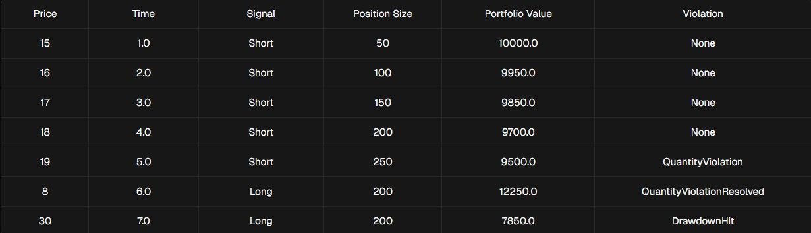

# Looking for alpha - Implement a backtesting engine

Your co-worker has given you your first task as a junior quantitative developer.

He's provided you with a list of price data and a strategy function which returns a long, hold, or short indicator and unsigned order quantity when fed a price. He's mentioned that he plans to run the strategy starting with an initial cash balance of $10,000, but doesn't want the strategy to result in a drawdown larger than 20% or a position larger than 200 units.

If, during trading, your position is either larger than 200 units, or results in a loss equal to or greater than 20%, you must halt trading. If your loss is equal to or greater than 20%, you must halt all trading indefinitely. If your position is larger than 200 units (either short or long), you must only take trades that offset your position, resulting in a smaller absolute position. For example -198 is smaller than -200 in absolute terms.

Return a list of tuples (`TimeStamp`, `Violation`) reflecting points in time when either of the two rules were violated as well as your portfolio's final value. For position violations, return when the position hit a magnitude above 200, and when you took a trade that reduced the magnitude of your position.

## Requirements

Your co-worker has given you some starter code to help you get going. The code contains the `Violation` and `Signal` enums as well as the BacktestEngine class you will implement.

The `Violation` enum represents the three events you need to track:

- `DrawdownHit`: Triggered if the portfolio value drops below 20% of the initial cash balance
- Upon hitting this threshold, all trading activity must cease immediately and the current backtest results should be returned.
- `QuantityViolation`: Triggered when the position size is greater than 200 units.
- If a `QuantityViolation` persists across multiple TimeStamps, only the initial occurrence should be recorded.
- QuantityViolationResolved: Triggers when there was a previous `QuantityViolation` and our position size was reduced to 200 units or below.

The `Signal` enum represents the three directional intents of the trading strategy:

- LONG: Attempt to go long or offset a short position.
- HOLD: Do nothing.
- SHORT: Attempt to go short or offset a long position.

The BacktestEngine class is initialized with an initial cash balance ($10,000) and a strategy.

Your job is to implement the backtest method which simulates the trading over time. The backtest method processes a stream of timestamped price data, executes trades based on the provided strategy, and returns both a record of `Violations` and the final total value of the portfolio.

For example, let's say we had the following prices and strategy:

```python

priceStream = [(15, 1.0), (16, 2.0), (17, 3.0), (18, 4.0), (19, 5.0), (8, 6.0), (30, 7.0)]

def simpleStrategy(price: Price) -> tuple[Signal, int]:
    if price >= 15:
        return Signal.SHORT, 50
    if price <= 8:
        return Signal.LONG, 50
    return Signal.HOLD, 0
```

Our timeline would look like:



and our results would be:

```python
[[(5.0, QuantityViolation), (6.0, QuantityViolationResolved), (7.0, DrawdownHit)], 7850.0]
```

## Notes

Any variable of type `Dollars` or `Price` must be rounded to the nearest 2 decimal places

For example, 4.10001 will be rounded to 4.1.

The order quantity returned from a strategy will be a positive value.

When a strategy returns `Signal.HOLD` it is always accompanied with an order quantity of zero.

You will always have enough cash to execute all orders a strategy tries to make.
